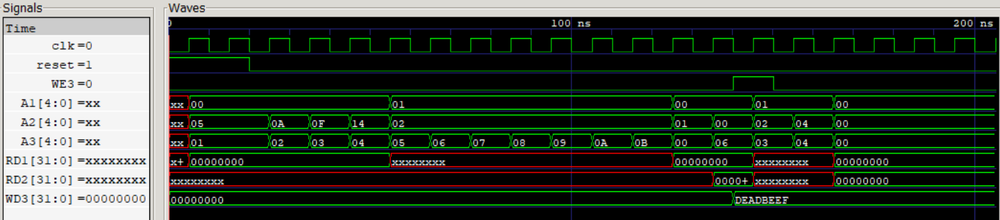
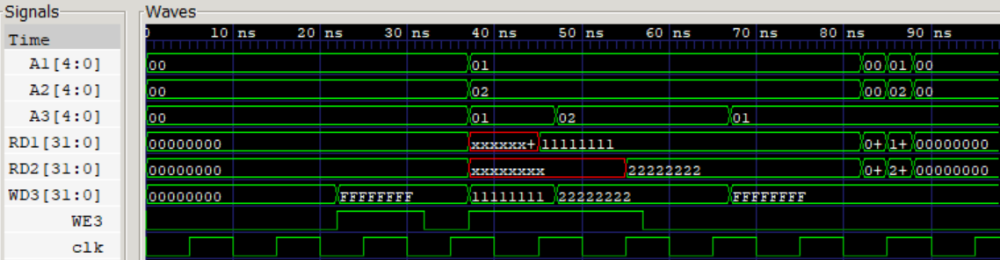

# 32-Bit RISC-V (RV32I) Processor Core

A 32-bit RISC-V CPU core designed in Verilog targeting the base RV32I integer instruction set. 

> ⚠️ **Status:** Active Development (Instruction Fetch & Register File Phase)

---

## 🏗️ Implemented Modules
* **Program Counter (PC):** Synchronous 32-bit PC register with sequential incrementing logic and reset control.
* **Instruction Memory:** Word-addressed memory module initialized with raw machine code for instruction fetch verification.
* **Register File:** 32x32-bit register array featuring dual asynchronous read ports, single synchronous write port, and hardwired `x0 = 0` logic.

---

## 🛠️ Tools & Verification
* **HDL:** Verilog
* **Simulation:** iVerilog / GTKWave
* **Verification:** Unit testbenches written for PC incrementing and Register File read/write hazard checks via waveform analysis.

---

## 📊 Functional Simulation & Waveforms

### Top-Level Instruction Fetch Waveform
Verification of the integrated top-level module demonstrating PC incrementing and fetching instructions from Instruction Memory on each clock edge:

### Register File Write/Read Timing
Detailed view of the Register File testbench verifying synchronous write to `x5` and asynchronous dual-port read execution:

## 🗺️ Next Steps (Targeted Architecture)
- [ ] Complete ALU module (R-type and I-type arithmetic/logic operations)
- [ ] Implement Main Control Unit and ALU Decoder
- [ ] Integrate Data Memory and Load/Store handling logic
- [ ] Verify full instruction execution via assembly test programs
